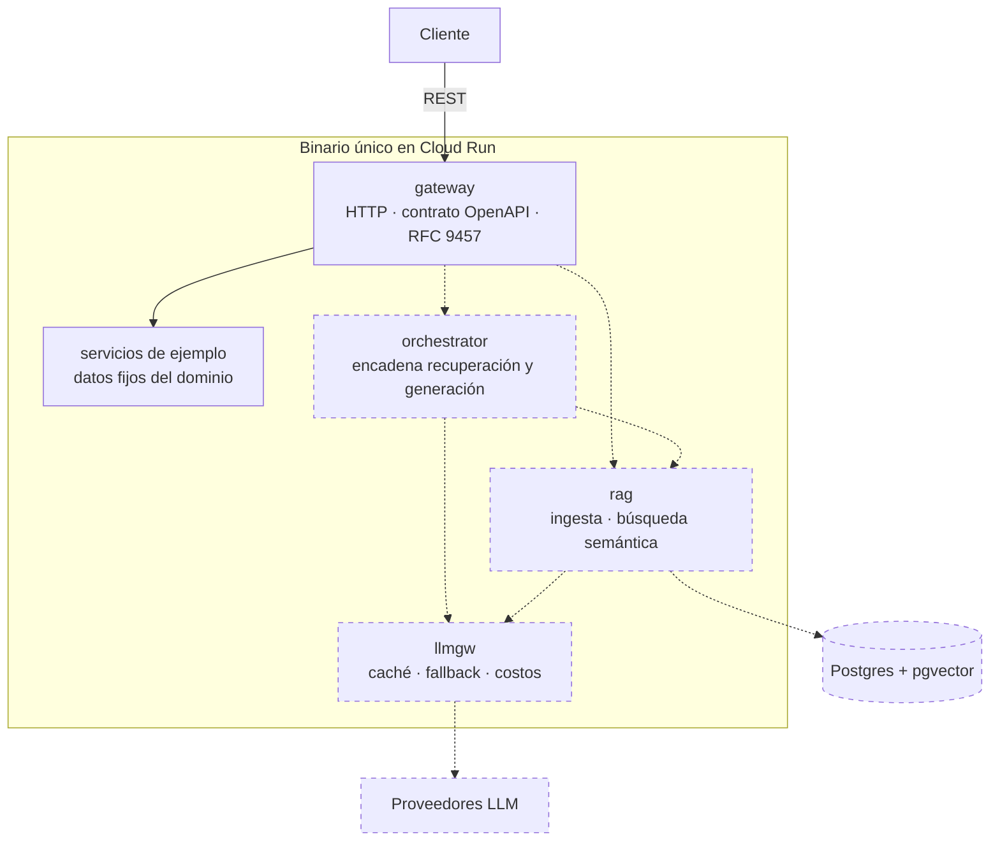

# AI Doc Platform

[](https://github.com/rodroguett/ai-doc-platform/actions/workflows/ci.yml)
[](https://github.com/rodroguett/ai-doc-platform/actions/workflows/deploy.yml)
[](https://go.dev)

Sistema de consulta sobre documentos regulatorios que responde en lenguaje
natural **citando la fuente exacta**, con control explícito del costo por
consulta y degradación controlada cuando el proveedor de generación falla.

El caso de uso que guía el diseño es el cumplimiento ambiental en la minería
chilena: una Resolución de Calificación Ambiental contiene cientos de
compromisos vinculantes repartidos entre el documento original, sus adendas y
los informes de seguimiento. Responder "¿qué comprometimos sobre el monitoreo
de material particulado?" hoy toma horas de búsqueda manual.

En un sector fiscalizado, **la trazabilidad de la respuesta importa más que su
fluidez**: una respuesta sin fuente verificable no sirve. Esa restricción es la
que ordena la arquitectura.

## Estado

En construcción. Este repositorio documenta el proceso, no solo el resultado:
las decisiones de diseño están registradas como
[ADRs](docs/adr/) y el historial de commits refleja la evolución real del
sistema, incluidos los errores y sus correcciones.

Hoy el sistema es **un solo binario desplegado en Cloud Run**. La API pública
está implementada a partir de su contrato, pero todavía no hay base de datos,
búsqueda ni llamadas a modelos: las consultas y la ingesta responden con datos
de ejemplo.

| Módulo | Estado |
|---|---|
| `gateway` | Desplegado. `POST /v1/queries` y `POST /v1/documents` responden con datos de ejemplo; el resto de los endpoints, 501 |
| `rag` | Pendiente: persistencia en Postgres con pgvector ([#23](https://github.com/rodroguett/ai-doc-platform/issues/23)), ingesta ([#24](https://github.com/rodroguett/ai-doc-platform/issues/24)), búsqueda ([#25](https://github.com/rodroguett/ai-doc-platform/issues/25)) |
| `orchestrator` | Pendiente |
| `llmgw` | Pendiente |

Demo: **https://gateway-w46qaen3gq-uc.a.run.app**

```bash
curl -s https://gateway-w46qaen3gq-uc.a.run.app/v1/queries \
  -H 'Content-Type: application/json' \
  -d '{"question": "¿Con qué frecuencia se monitorea el agua subterránea?"}'
```

La respuesta trae citas a una RCA, su adenda y un informe de seguimiento de un
proyecto ficticio, junto con la traza de ejecución. La traza declara
`"provider": "example"`: en este dominio, una respuesta fabricada no debe
poder confundirse con una real.

## Arquitectura

El sistema se construye como un **monolito modular**: un binario con cuatro
módulos de fronteras explícitas, que se extraerán como servicios
independientes solo cuando una condición concreta lo justifique. El
razonamiento y esas condiciones están en
[ADR-0005](docs/adr/0005-monolito-modular.md).



Las líneas y cajas punteadas están planificadas; las sólidas existen. Los
servicios de ejemplo desaparecen cuando `orchestrator` y `rag` los reemplacen.

**Cada módulo expone un contrato y oculta su implementación.** Otro módulo solo
puede importar su paquete raíz, nunca sus subpaquetes, y nadie importa el
gateway. La regla se verifica en CI con `depguard`. Cuando un módulo se
extraiga, ese paquete raíz se convertirá en su contrato gRPC.

**La ingesta es asíncrona.** Procesar un documento de trescientas páginas y
generar sus embeddings toma minutos. El endpoint responde `202 Accepted` con un
identificador de trabajo. Cómo se ejecuta ese trabajo en Cloud Run, que por
omisión solo asigna CPU mientras atiende una petición, se decide en [#24](https://github.com/rodroguett/ai-doc-platform/issues/24).

**`llmgw` concentrará las decisiones operacionales.** Caché de respuestas,
fallback entre proveedores y conteo de tokens vivirán ahí. Cada respuesta
declarará en su traza qué proveedor la generó, si hubo acierto de caché y
cuánto costó.

## Contrato

La API está especificada en [`api/openapi.yaml`](api/openapi.yaml) y el
servidor se genera a partir de ella
([ADR-0004](docs/adr/0004-spec-first.md)). El diseño sigue tres reglas:

- Las consultas son `POST /v1/queries`, no una búsqueda idempotente: consumen
  tokens, generan costo y se registran para auditoría.
- Los errores siguen [RFC 9457](https://www.rfc-editor.org/rfc/rfc9457) con
  `application/problem+json`.
- La paginación es por cursor, no por desplazamiento, para que la ingesta
  concurrente no produzca saltos ni duplicados.

Toda respuesta incluye las citas al documento origen y una traza con el
proveedor, el estado de la caché, los tokens consumidos y la latencia
desglosada entre recuperación y generación.

## Ejecución local

Para configurar un entorno nuevo con las versiones de herramientas que el
proyecto declara ([ADR-0002](docs/adr/0002-tool-versions.md)):

```bash
./scripts/bootstrap.sh
```

Luego:

```bash
make run          # levanta el gateway en :8080
make test         # tests con detector de condiciones de carrera
make lint         # golangci-lint, incluidas las fronteras entre módulos
make generate     # regenera el servidor tras editar el contrato
```

```bash
curl -s localhost:8080/v1/queries \
  -H 'Content-Type: application/json' \
  -d '{"question": "¿Con qué frecuencia se monitorea el agua subterránea?"}'
```

## Estructura

```
cmd/gateway/      el binario; conecta las implementaciones de cada módulo
internal/         un paquete por módulo; platform/ contiene lo compartido
api/              contrato OpenAPI y configuración de la generación
docs/adr/         decisiones de arquitectura
scripts/          instalación de herramientas
```

Todo vive en un monorepo con un único módulo Go
([ADR-0001](docs/adr/0001-monorepo.md)).

## Despliegue

Cada merge a `main` construye la imagen y despliega a Cloud Run
automáticamente. La autenticación usa Workload Identity Federation: GitHub
emite un token OIDC firmado que GCP valida contra una condición que restringe
el acceso a este repositorio, y devuelve credenciales temporales. **No existen
claves de servicio almacenadas en el repositorio.**

La imagen se etiqueta con el SHA del commit además de `latest`, de modo que
cada revisión apunta a una imagen inmutable y el rollback a un commit exacto es
posible.

El runtime es una imagen distroless de unos 10 MB, sin shell ni gestor de
paquetes, ejecutando como usuario no privilegiado. El servicio escala a cero
cuando no hay tráfico, con un tope de tres instancias como límite de gasto.

## Decisiones registradas

Los ADRs documentan por qué el sistema es como es, incluidas las consecuencias
negativas de cada decisión. Un registro donde todas las decisiones salieron
bien no es un registro, es publicidad.

- [ADR-0001](docs/adr/0001-monorepo.md) — Alojar todos los servicios en un monorepo
- [ADR-0002](docs/adr/0002-tool-versions.md) — Fijar versiones exactas de las herramientas de desarrollo
- [ADR-0003](docs/adr/0003-github-flow.md) — Adoptar GitHub Flow con despliegue continuo
- [ADR-0004](docs/adr/0004-spec-first.md) — Derivar el servidor del contrato OpenAPI
- [ADR-0005](docs/adr/0005-monolito-modular.md) — Construir como monolito modular antes de extraer servicios

## Contribuir

El flujo de trabajo, la convención de commits y la definición de terminado
están en [CONTRIBUTING.md](CONTRIBUTING.md).
