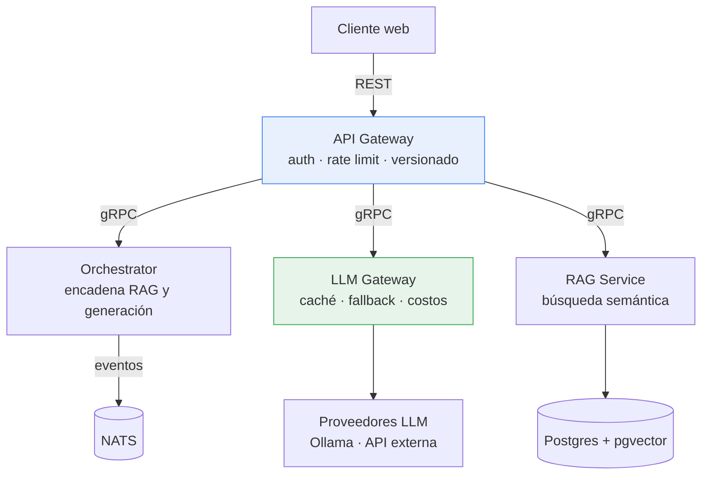

# AI Doc Platform

[](https://github.com/rodroguett/ai-doc-platform/actions/workflows/ci.yml)
[](https://github.com/rodroguett/ai-doc-platform/actions/workflows/deploy.yml)
[](https://go.dev)

Sistema de consulta sobre documentos regulatorios que responde en lenguaje
natural **citando la fuente exacta**, con control explícito del costo por
consulta y degradación controlada cuando el proveedor de generación falla.

El caso de uso que guía el diseño es el cumplimiento ambiental en la minería
chilena: una Resolución de Calificación Ambiental contiene cientos de
compromisos vinculantes repartidos entre el documento original, sus adendas y
los informes de seguimiento. Responder "¿qué comprometimos sobre el monitoreo
de material particulado?" hoy toma horas de búsqueda manual.

En un sector fiscalizado, **la trazabilidad de la respuesta importa más que su
fluidez**: una respuesta sin fuente verificable no sirve. Esa restricción es la
que ordena la arquitectura.

## Estado

En construcción. Este repositorio documenta el proceso, no solo el resultado:
las decisiones de diseño están registradas como
[ADRs](docs/adr/) y el historial de commits refleja la evolución real del
sistema, incluidos los errores y sus correcciones.

| Componente | Estado |
|---|---|
| API Gateway | Esqueleto desplegado |
| Contrato OpenAPI | Definido, sin implementar |
| RAG Service | Pendiente |
| LLM Gateway | Pendiente |
| Orchestrator | Pendiente |

Demo: **https://gateway-w46qaen3gq-uc.a.run.app/health**

## Arquitectura



**REST hacia afuera, gRPC hacia adentro.** El contrato público debe ser
explorable y versionable; entre servicios internos pesan más los contratos
tipados y el menor overhead de serialización.

**La ingesta es asíncrona.** Procesar un documento de trescientas páginas y
generar sus embeddings toma minutos. El endpoint responde `202 Accepted` con un
identificador de trabajo y el procesamiento sale por NATS.

**El LLM Gateway concentra las decisiones operacionales.** Es el servicio más
pequeño y el de mayor densidad arquitectónica: caché de respuestas, circuit
breaker, fallback entre proveedores y conteo de tokens viven ahí. Cada
respuesta declara en su traza qué proveedor la generó, si hubo acierto de
caché y cuánto costó.

## Contrato

La API está especificada en [`api/openapi.yaml`](api/openapi.yaml). El diseño
sigue tres reglas:

- Las consultas son `POST /v1/queries`, no una búsqueda idempotente: consumen
  tokens, generan costo y se registran para auditoría.
- Los errores siguen [RFC 9457](https://www.rfc-editor.org/rfc/rfc9457) con
  `application/problem+json`.
- La paginación es por cursor, no por desplazamiento, para que la ingesta
  concurrente no produzca saltos ni duplicados.

Toda respuesta incluye las citas al documento origen y una traza con el
proveedor, el estado de la caché, los tokens consumidos y la latencia
desglosada entre recuperación y generación.

## Ejecución local

```bash
make run          # levanta el gateway en :8080
make test         # tests con detector de condiciones de carrera
make lint         # golangci-lint
```

```bash
curl -s localhost:8080/health
```

## Estructura

```
cmd/          binarios de cada servicio
internal/     implementación; platform/ contiene lo compartido
api/          contrato OpenAPI
proto/        contratos gRPC entre servicios
docs/adr/     decisiones de arquitectura
deploy/       infraestructura y despliegue
```

Los servicios viven en un monorepo con un único módulo Go. La independencia
entre ellos se mantiene por convención: `internal/<servicio>` no importa a otro
`internal/<servicio>`, y la única frontera permitida son los contratos de
`proto/` y `api/`. El razonamiento completo está en
[ADR-0001](docs/adr/0001-monorepo.md).

## Despliegue

Cada merge a `main` construye la imagen y despliega a Cloud Run
automáticamente. La autenticación usa Workload Identity Federation: GitHub
emite un token OIDC firmado que GCP valida contra una condición que restringe
el acceso a este repositorio, y devuelve credenciales temporales. **No existen
claves de servicio almacenadas en el repositorio.**

La imagen se etiqueta con el SHA del commit además de `latest`, de modo que
cada revisión apunta a una imagen inmutable y el rollback a un commit exacto es
posible.

El runtime es una imagen distroless de aproximadamente 15 MB, sin shell ni
gestor de paquetes, ejecutando como usuario no privilegiado. El servicio escala
a cero cuando no hay tráfico, con un tope de instancias configurado como
límite de gasto.

## Decisiones registradas

Los ADRs documentan por qué el sistema es como es, incluidas las consecuencias
negativas de cada decisión. Un registro donde todas las decisiones salieron
bien no es un registro, es publicidad.

- [ADR-0001](docs/adr/0001-monorepo.md) — Alojar todos los servicios en un monorepo
- [ADR-0002](docs/adr/0002-tool-versions.md) — Fijar versiones exactas de las herramientas de desarrollo
- [ADR-0003](docs/adr/0003-github-flow.md) — Adoptar GitHub Flow con despliegue continuo
- [ADR-0004](docs/adr/0004-spect-first.md) — Derivar el servidor del contrato OpenAPI

## Contribuir

El flujo de trabajo, la convención de commits y la definición de terminado
están en [CONTRIBUTING.md](CONTRIBUTING.md).

## Ejecución local

Para configurar un entorno nuevo con las versiones de herramientas que el
proyecto declara:

```bash
./scripts/bootstrap.sh
```